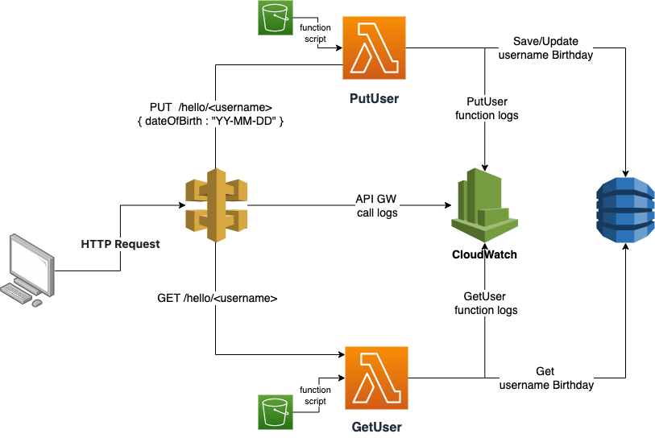

# API Gateway HTTP API with Lambda integration

This project contains source code and supporting files for a serverless application running in AWS. It includes the following files and folders.

- infra - Terraform code for all the resources of the application
- data_model - DynamoDB Data Model in JSON (for local deployment)
- tests - Test JSON events for the lambdas

## Deployment


The application uses several AWS resources, including Lambda functions and an API Gateway API. These resources are defined in the `infra` directory in this project. In order to deploy all these resources, run the following commands:

```bash
terraform plan
terraform apply
```

This will deploy the 22 necessary resources to launch two lambda functions through the same API Gateway.
One of the outputs will be `base_url`, which gives us the URL to the deployed API.

We can use this output variable to use the API directly from our local machine.

## Usage
First, run the PUT Requests so there is data in the DynamoDB. There are four different events that you can paste in the testing tab directly in the AWS Lambda Console in `tests` directory.

#### PUT request
```bash
curl --request PUT \
--header "Content-Type: application/json" \
--data '{"dateOfBirth": "1994-08-30"}' \
"$(terraform output -raw base_url)/hello/Fran"
```
This type of requests does not return any message, unless there is an error with the date.
#### GET request
```bash
curl "$(terraform output -raw base_url)/hello/<username>"
```
#### Response
```bash
{ "message": "Hello Fran! Your Birthday is in 69 days!"}
```